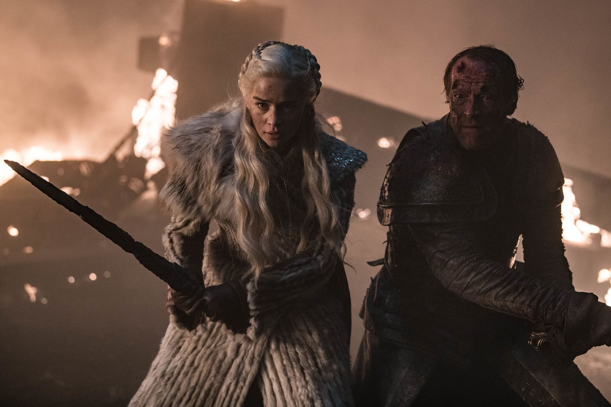
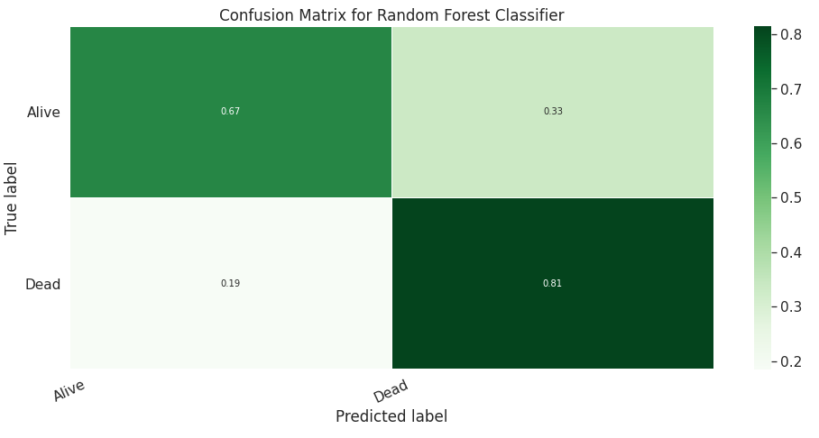
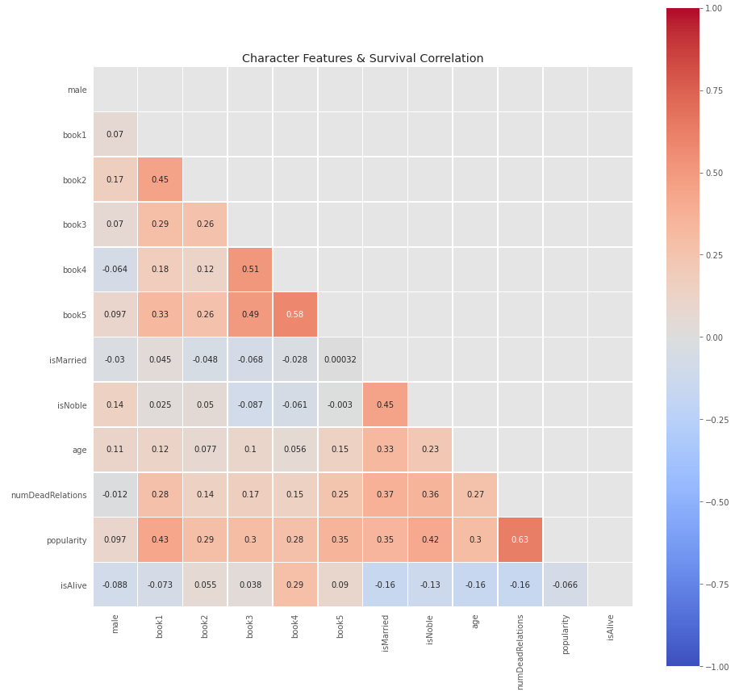
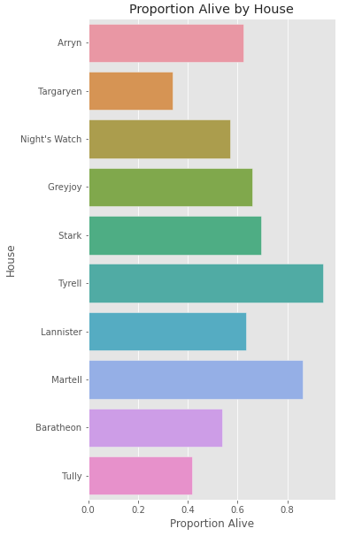

# Game of Thrones Death Predictor
#### Exploring Use Cases for Machine Learning in Fiction

#Use ML to Model Who Will Die in Game of Thrones 
Project Status: Complete
 
## Table of contents
- [Objective](#objective)
- [Results](#results)
- [Data](#data)
- [Methods](#methods)
- [Technologies](#technologies)
- [Limitations](#limitations)
- [Future Work](#futurework)
 
## Objective
This is a machine learning project to train a model to classify Game of Thrones characters as dead or alive. We a specific point in time, the end of book 5, after which the TV series and books diverge more frequently. The Game of Thrones TV series is based on George RR Martin’s “A Song of Fire and Ice” 7 book series. 
 
## Results
Of the 3 models: a Baseline Classifier, Logistic Regression and Random Forest, the Random Forest model was the most accurate. The Baseline model which always predicts the most common class had an accuracy score of 0.620, Logistic Regression 0.691 and Random Forest 0.759. 
 

 
When classes are imbalanced, it’s good practice to consider additional metrics beyond accuracy to measure classifier performance. Our classes aren’t too skewed: 62% of characters are alive, 38% dead, but let’s look into the Out of bag (OOB) score. The OOB score for the Random Forest model is 0.767, indicating the model will be accurate when applied to new unseen data. 
 
Let’s look at the correlation between features in the dataset. In the correlation matrix below we see there aren't any strong positive or negative correlations between a character's survival and the features in our dataset. Strong correlations are 0.8 and up, weak ones are under 0.5. The highest correlation occurs between a character’s popularity and the number of dead relatives they have. Only the numeric column correlations were calculated, so it's possible there's a correlation between survival and non-numeric columns such as house or culture.
 

 
Digging into the house variable, House Tyrell is the most intact, while Targaryens have the fewest members of their house alive. This matches up with the history of Westeros which includes a major war between two Targaryens that resulted in the destruction of most of house Targaryen and nearly all their dragons.
 

 
## Data
The raw data contains 1946 characters from the Westeros wiki http://awoiaf.westeros.org, in csv format by the A Song of Ice and Data team. Features in the data set included: “is alive”, “married”, “single”, “has dead brothers/sisters”, a “popularity” score (page-rank based on inbound links to the character’s wiki page), “house”, “culture”. 

## Methods
+ Data Cleaning
+ Exploratory Data Analysis
+ Data Visualization
+ Machine Learning

I chose supervised learning models since the data had a labeled response for the feature I wanted to predict. If the character was alive by the end of the 5th book, they were counted as “alive”. I dropped that column from my training data, and used it as an answer key to compare how well each machine learning model predicted. I started with a simple model first (Logistic Regression) before trying more complex models like Naive Bayes, Decision Trees, and Random Forest.
The workflow was: acquire data, look for insights and patterns with an exploratory data analysis, split data into training and test sets, apply machine learning models, score each model, and compare results across models. 

## Technologies
+ Python
+ Pandas
+ NumPy
+ Seaborn
+ Matplotlib
+ Sklearn - preprocessing
+ Sklearn.preprocessing - StandardScaler
+ Sklearn.metrics - accuracy_score, confusion_matrix, plot_confusion_matrix, classification_report
+ Sklearn.model_selection - cross_val_score, train_test_split
+ Sklearn.preprocessing - StandardScaler
+ Sklearn.dummy - DummyClassifier
+ Sklearn.linear_model - LogisticRegression
+ Sklearn.ensemble - RandomForestClassifier
 
## LIMITATIONS
There are several limitations to this kind of model.
+ Generalizability: One of the most helpful features for predicting death was the popularity score, so if you wanted to use a model like this to win bets with friends about another fantasy series that doesn’t have an extensive online wiki dedicated to it that might not work so well.
+ Books vs TV series: The model is trained on book data, and the TV series differs from the books. The model does not account for characters who have died in the TV series, but are still alive in the book series. For example, Stannis was among those predicted next to die, but in the TV show he had already died.
+ Snapshot in Time: As the story progresses more characters will die. The model currently uses the snapshot of the end of the 5th book.
+ Resurrection: The model currently does not track how many times a character dies. Characters who come back from the dead by the end of the 5th book are counted as alive. 

## FUTURE WORK
+ Iterate on the model: I used basic ML models here since I wanted a high level of explainability and insight into which features impacted predictions. It would be interesting to see results of more complex ML models & feature engineering.
+ Moving Window: The model could make predictions for different time periods of the story.
+ Increase Generalizability: It’d be interesting to try building a generalized plot predictor that performed well across many different fantasy series.
+ What about the animals? The source data didn’t include direwolves, but if you add pet data let me know what you find. :)
+ Push to Production: The model could be turned into an interactive app.
